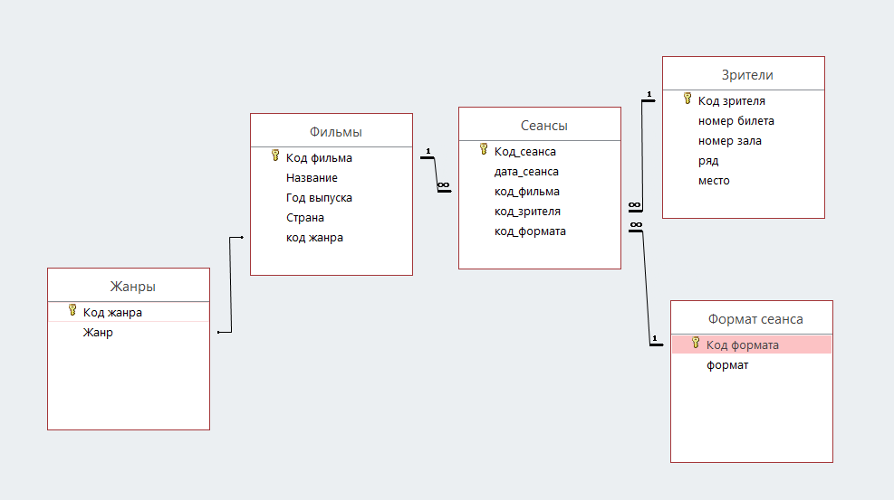

# Контрольная работа 
---
## Лабораторная работа №1 
### Создание модели реляционной базы данных
**_Кинотеатр_**


---
## Лабораторная работа №2
### Создание сервера в postgresql
---

## Лабораторная работа №3
### Создание базы данных, таблиц и связей между ними 
**Создание таблицы genre**
```
CREATE TABLE genre
(
	id SERIAL PRIMARY KEY,
	genre_name VARCHAR(50)
);
```
**Создание таблицы klients**
```
CREATE TABLE klients
(
	id SERIAL PRIMARY KEY,
	number_ticket VARCHAR(50),
	number_zal VARCHAR(50),
	ryad INTEGER,
	mesto INTEGER
)
```
**Создание таблицы film**
```
CREATE TABLE film
(
	id SERIAL PRIMARY KEY,	
	name_film VARCHAR(50),
	phone VARCHAR(50),	
	country VARCHAR(50),
	genre_id INTEGER REFERENCES genre(id)
);
```
**Создание таблицы format**
```
CREATE TABLE format
(
	id SERIAL PRIMARY KEY,	
	format VARCHAR(10)	
);
```
**Создание таблицы seanse c Foreign Key**
```
CREATE TABLE seanse
(
	id SERIAL PRIMARY KEY,	
	date DATE DEFAULT NOW(),
	film_id INTEGER REFERENCES film(id),
	klients_id INTEGER REFERENCES klients(id),
	format_id INTEGER REFERENCES format(id)
);

```

---
## Лабораторная работа №4
### Ввод и редактирование информации в базе данных

Добавил в таблицы данные (пример добавления записей)
```
insert into genre (genre_name) values ('комедия');
insert into genre (genre_name) values ('триллер');
insert into genre (genre_name) values ('ужасы');
insert into genre (genre_name) values ('драма');
insert into genre (genre_name) values ('детектив');
insert into genre (genre_name) values ('мультфильмы');
insert into genre (genre_name) values ('фэнтези');
insert into genre (genre_name) values ('фантистика');
insert into genre (genre_name) values ('документальные');
insert into genre (genre_name) values ('криминальные');
insert into film (name_film, country, genre_id) values ('Один плюс один', 'Франция', 1);
insert into film (name_film, country, genre_id) values ('13 район', 'Франция', 10);
insert into film (name_film, country, genre_id) values ('Мстители Финал', 'США', 8);
insert into film (name_film, country, genre_id) values ('Питер Пен', 'США', 7);
insert into film (name_film, country, genre_id) values ('Третий лишний', 'США', 1);
insert into film (name_film, country, genre_id) values ('Бал безумных женьщин', 'Англия', 4);
insert into film (name_film, country, genre_id) values ('Винипух', 'СССР', 6);
insert into film (name_film, country, genre_id) values ('Гоголь', 'Россия', 3);
insert into film (name_film, country, genre_id) values ('Достать ножи', 'США', 5);
insert into film (name_film, country, genre_id) values ('Калашников', 'США',3);
```
Обновление данных
```
UPDATE film SET name_film = '1+1' WHERE id = 1;
```

---
## Лабораторная работа №5
### Создание простых запросов на выборку

Заброс на один столбец таблицы 
```
SELECT name_film FROM film;
```
Запрос на все столбцы таблицы
```
SELECT * FROM film;
```
Выборка двух колонок таблицы
```
SELECT name_film, country FROM film;
```

Выборка с сортировкой 
```
SELECT name_film FROM film ORDER BY name_film
```
Выборка с условием и сортировкой 
```
SELECT * FROM film Where name_film = '1+1'
```
Выборка с BETWEEN
```
SELECT * FROM film WHERE id between 2 and 6;
```
Выборка первых 5 записей
```
SELECT * FROM film LIMIT 5;
```
Выборка с Aliases
```
SELECT name_film AS name FROM film;
```

Выборка с LIKE 
```
SELECT * FROM film WHERE name_film LIKE '1%';
```

---
## Лабораторная работа №6
### Создание запросов с использованием агрегатных функций и группировки
Запрос с функциями MAX, MIN, COUNT
```
SELECT MIN(date) AS Дата_первого_сеанса,  
MAX(date) AS Дата_последнего_сеанса,
COUNT(date) AS Всего_сеансов
FROM seanse;

 Дата_первого_сеанса | Дата_последнего_сеанса | Всего_сеансов
---------------------+------------------------+---------------
 2019-06-01          | 2022-06-25             |          2000
```
Запрос с функцией COUNT
```
SELECT count(number_ticket) FROM klients WHERE number_ticket = 5;
| count|
--------
|  11  |
```
Запрос с сортировкой по number_zal и выводом первых 10 записей
```
SELECT * FROM klients ORDER BY number_zal LIMIT 10;

 id  | number_ticket | number_zal | ryad | mesto
-----+---------------+------------+------+-------
 510 |            11 |          1 |   42 |    38
 693 |            13 |          1 |   26 |    84
 457 |            57 |          1 |   38 |    59
 435 |            43 |          1 |   59 |    85
   7 |            46 |          1 |   48 |    13
 526 |            66 |          1 |   65 |    67
  33 |            53 |          1 |   24 |    82
 194 |            86 |          1 |   31 |    91
 772 |            67 |          1 |   24 |    37
 734 |            70 |          1 |   85 |    49
```
---
## Лабораторная работа №7, 8, 9
### Создание представлений, функция и треггеров 
#### - Представление
Создать представление и просмотреть 
```
CREATE VIEW seanse_date 
AS SELECT * FROM seanse
WHERE date = '2021-08-29';
```
Просмотр представления seanse_date
```
SELECT * FROM seanse_date;
 id  |    date    | film_id | klients_id | format_id
------+------------+---------+------------+-----------
   11 | 2021-08-29 |       2 |          2 |         9
  536 | 2021-08-29 |       3 |          3 |         4
 1608 | 2021-08-29 |       2 |          8 |         7
```
#### - Процедура
Создание процедуры
```
CREATE PROCEDURE Add_klients(
@number_ticket_tmp INTEGER,
@number_zal_tmp INTEGER(100),
@ryad_tmp INTEGER,
@mesto_tmp INTEGER
)
INSERT INTO klients(number_ticket, number_zal, ryad, mesto)
VALUES (@number_ticket_tmp, @number_zal_tmp, @ryad_tmp, @mesto_tmp);
```

Применение процедуры 
```
CALL Add_klients(1, 2, 3, 4);
```

#### - Функция
Создание функции
```
CREATE FUNCTION number_ticket (ticket INTEGER)
RETURNS SETOF integer AS 
$$     
     SELECT mesto FROM klients
         WHERE number_ticket = $1
$$
LANGUAGE sql
```
Вызов функции 
```
SELECT number_ticket(1) AS name;
____________________________________
 name
------
   41
   50
   17
   80
   55
    8
   56
   64
   85
   93
```
 
#### - Триггеры и триггерные функции

Создание треггерной функции **history_function**
```
CREATE OR REPLACE FUNCTION history_function()
  RETURNS trigger AS $BODY$
BEGIN
    INSERT INTO history (date_append, id_seanse) VALUES (NOW(), NEW.id);
	RETURN NEW;
END $BODY$
LANGUAGE plpgsql;
```
Создание триггера **history_trigger**
```
CREATE TRIGGER history_trigger
AFTER INSERT
ON seanse
FOR EACH ROW
EXECUTE PROCEDURE history_function();
```
Вставка данных в таблицу **worker**
```
insert into seanse (date, film_id, klients_id, format_id) 
values ('2022-06-27', 10, 2, 5);
```

Триггер history_trigger добавил запись в таблицу history
```
id | date_append | id_seanse
----+-------------+-----------
  1 | 2022-06-27  |      2011
```

---
## Лабораторная работа №10
### Создание ролей. Права ролей
Просмотр текущей роли
```
SELECT session_user; -- session user name
 session_user
 ------------
 postgres
(1 row)
```

Создание роли **users**, **users** ни может вносить изменения в базу данных. Роль активна до 2022-08-30 | 20:03:42, лимит подключений отсутствует.
```
CREATE ROLE users WITH
 LOGIN
 NOSUPERUSER
 NOCREATEDB
 NOCREATEROLE
 NOINHERIT
 NOREPLICATION
 CONNECTION LIMIT -1
 VALID UNTIL '2022-08-30T10:14:32+03:00'
 PASSWORD 'user';
```
Просмотрел список ролей.
```
\du                                    List of roles
  Role name  |                         Attributes                         | Member of
-------------+------------------------------------------------------------+-----------
 users       | Не наследуется                                            +| {}
             | Пароль действует до 2022-08-30 10:14:32+03                 |
 postgres    | Superuser, Create role, Create DB, Replication, Bypass RLS | {}
```

---
## Лабораторная работа №11
### Резервное копирование
База данных **doni**
```
doni=# \d
                     Список отношений
 Схема  |       Имя       |        Тип         | Владелец
--------+-----------------+--------------------+----------
 public | film            | таблица            | postgres
 public | film_id_seq     | последовательность | postgres
 public | format          | таблица            | postgres
 public | format_id_seq   | последовательность | postgres
 public | genre           | таблица            | postgres
 public | genre_id_seq    | последовательность | postgres
 public | history         | таблица            | postgres
 public | history_id_seq  | последовательность | postgres
 public | klients         | таблица            | postgres
 public | klients_id_seq  | последовательность | postgres
 public | seanse          | таблица            | postgres
 public | seanse_date     | представление      | postgres
 public | seanse_id_seq   | последовательность | postgres
 public | seanse_now_date | представление      | postgres
(14 строк)
```

Создание резервной копии базы данных **doni**
```
 pg_dump -Fc -v --host=localhost --username=postgres --dbname=doni -f doni.dump;
```

Импорт резервной копии doni.dump в базу данных **dump_doni**
```
 pg_restore -v --no-owner --host=localhost --username=postgres --dbname=dump_doni doni.dump
```
Импорт завершен успешно.
 ```
dump_doni=# \d
                     Список отношений
 Схема  |       Имя       |        Тип         | Владелец
--------+-----------------+--------------------+----------
 public | film            | таблица            | postgres
 public | film_id_seq     | последовательность | postgres
 public | format          | таблица            | postgres
 public | format_id_seq   | последовательность | postgres
 public | genre           | таблица            | postgres
 public | genre_id_seq    | последовательность | postgres
 public | history         | таблица            | postgres
 public | history_id_seq  | последовательность | postgres
 public | klients         | таблица            | postgres
 public | klients_id_seq  | последовательность | postgres
 public | seanse          | таблица            | postgres
 public | seanse_date     | представление      | postgres
 public | seanse_id_seq   | последовательность | postgres
 public | seanse_now_date | представление      | postgres
(14 строк)
 ```
